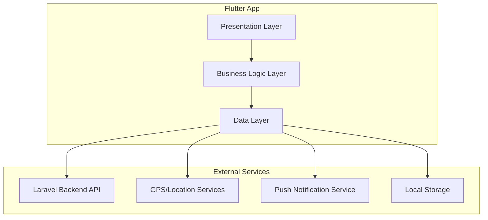

# Design Document

## Overview

The Flutter tracker_app is a cross-platform mobile application built using Flutter framework that provides real-time family location tracking capabilities. The app follows a clean architecture pattern with clear separation between presentation, business logic, and data layers. It integrates with an existing Laravel backend API using Sanctum token authentication and implements robust offline capabilities, background location services, and real-time updates.

The application prioritizes user experience with intuitive navigation, responsive design, and comprehensive error handling while maintaining high security standards for location data and user privacy.

## Architecture

### High-Level Architecture



### Architecture Patterns

**Clean Architecture**: The app follows clean architecture principles with dependency inversion, ensuring testability and maintainability.

**BLoC Pattern**: Business Logic Components (BLoC) manage state and handle business logic, providing reactive programming with streams.

**Repository Pattern**: Data access is abstracted through repositories, enabling easy testing and data source switching.

**Service Locator**: GetIt is used for dependency injection, providing loose coupling between components.

## Components and Interfaces

### Core Components

#### 1. Authentication Module
- **AuthBloc**: Manages authentication state and user sessions
- **AuthRepository**: Handles API authentication calls and token management
- **SecureStorage**: Manages secure token storage using flutter_secure_storage
- **LoginScreen**: User interface for authentication

#### 2. Device Management Module
- **DeviceBloc**: Manages device registration and configuration
- **DeviceRepository**: Handles device-related API calls
- **AvatarService**: Manages avatar selection and caching
- **DeviceRegistrationScreen**: Interface for device setup

#### 3. Location Tracking Module
- **LocationBloc**: Manages location state and tracking configuration
- **LocationService**: Handles GPS location acquisition and background tracking
- **LocationRepository**: Manages location ping submission and queuing
- **BackgroundLocationService**: Continues tracking when app is backgrounded

#### 4. Map and Family View Module
- **MapBloc**: Manages map state and family member locations
- **FamilyRepository**: Fetches family member locations and status
- **MapScreen**: Interactive map displaying family locations
- **FamilyMemberCard**: UI component for displaying member details

#### 5. Offline and Sync Module
- **SyncBloc**: Manages offline data synchronization
- **LocalDatabase**: SQLite database for offline data storage
- **NetworkConnectivity**: Monitors network status
- **SyncService**: Handles data synchronization when online

### Key Interfaces

#### LocationService Interface
```dart
abstract class LocationService {
  Stream<LocationData> get locationStream;
  Future<bool> requestPermissions();
  Future<void> startTracking();
  Future<void> stopTracking();
  Future<LocationData?> getCurrentLocation();
}
```

#### AuthRepository Interface
```dart
abstract class AuthRepository {
  Future<AuthResult> login(String username, String password);
  Future<void> logout();
  Future<String?> getStoredToken();
  Stream<AuthState> get authStateStream;
}
```

#### DeviceRepository Interface
```dart
abstract class DeviceRepository {
  Future<DeviceResult> registerDevice(DeviceRegistration registration);
  Future<List<AvatarIcon>> getAvatarIcons();
  Future<void> updateDeviceName(String deviceId, String name);
  Future<VerificationCode> generateVerificationCode(String deviceId);
  Future<void> deleteDeviceWithCode(String deviceId, String code);
}
```

## Data Models

### Core Data Models

#### User Model
```dart
class User {
  final String id;
  final String username;
  final String email;
  final Avatar? avatar;
  final DateTime createdAt;
  final DateTime updatedAt;
}
```

#### Device Model
```dart
class Device {
  final String deviceId;
  final String name;
  final AvatarType avatarType;
  final String avatarValue;
  final bool isActive;
  final DateTime lastSeen;
  final DeviceStatus status;
}
```

#### LocationData Model
```dart
class LocationData {
  final String deviceId;
  final double latitude;
  final double longitude;
  final double accuracy;
  final int batteryLevel;
  final int signalStrength;
  final bool microphoneStatus;
  final bool cameraStatus;
  final bool recordingStatus;
  final DateTime timestamp;
  final bool isStale;
}
```

#### Avatar Model
```dart
class Avatar {
  final AvatarType type;
  final String value;
  final String? url;
  final String? emoji;
  final String? color;
}

enum AvatarType { icon, image }
```

#### Authentication Models
```dart
class AuthResult {
  final bool success;
  final String? token;
  final User? user;
  final String? errorMessage;
}

class AuthState {
  final bool isAuthenticated;
  final User? user;
  final String? token;
}
```

### Local Database Schema

#### Cached Locations Table
```sql
CREATE TABLE cached_locations (
  id INTEGER PRIMARY KEY AUTOINCREMENT,
  device_id TEXT NOT NULL,
  latitude REAL NOT NULL,
  longitude REAL NOT NULL,
  accuracy REAL NOT NULL,
  battery_level INTEGER NOT NULL,
  signal_strength INTEGER NOT NULL,
  microphone_status INTEGER NOT NULL,
  camera_status INTEGER NOT NULL,
  recording_status INTEGER NOT NULL,
  timestamp INTEGER NOT NULL,
  synced INTEGER DEFAULT 0,
  created_at INTEGER NOT NULL
);
```

#### Pending Location Pings Table
```sql
CREATE TABLE pending_pings (
  id INTEGER PRIMARY KEY AUTOINCREMENT,
  device_id TEXT NOT NULL,
  name TEXT NOT NULL,
  latitude REAL NOT NULL,
  longitude REAL NOT NULL,
  accuracy REAL NOT NULL,
  battery_level INTEGER NOT NULL,
  signal_strength INTEGER NOT NULL,
  microphone_status INTEGER NOT NULL,
  camera_status INTEGER NOT NULL,
  recording_status INTEGER NOT NULL,
  timestamp INTEGER NOT NULL,
  retry_count INTEGER DEFAULT 0,
  created_at INTEGER NOT NULL
);
```

## Correctness Properties

*A property is a characteristic or behavior that should hold true across all valid executions of a system-essentially, a formal statement about what the system should do. Properties serve as the bridge between human-readable specifications and machine-verifiable correctness guarantees.*

After analyzing the acceptance criteria, I've identified properties that can be tested through property-based testing. Some redundant properties have been consolidated to provide unique validation value.

### Authentication Properties

**Property 1: Valid credential authentication**
*For any* valid username and password combination, authentication should succeed and return a valid Sanctum token that gets stored securely
**Validates: Requirements 1.2**

**Property 2: Invalid credential rejection**
*For any* invalid username or password combination, authentication should fail and display an appropriate error message
**Validates: Requirements 1.3**

**Property 3: Authenticated user navigation**
*For any* authenticated user state, app launch should automatically navigate to the main screen
**Validates: Requirements 1.4**

**Property 4: Logout token clearing**
*For any* authenticated user, logout should clear all stored authentication tokens and return to login screen
**Validates: Requirements 1.5**

### Device Management Properties

**Property 5: Device registration uniqueness**
*For any* device registration request, the generated device ID should be unique and successfully transmitted to backend with name and avatar
**Validates: Requirements 2.2**

**Property 6: Successful registration storage**
*For any* successful device registration, the device ID should be stored locally and navigation should proceed to main application
**Validates: Requirements 2.4**

**Property 7: Device name updates**
*For any* valid device name change, the update should be successfully transmitted to backend API
**Validates: Requirements 2.5**

### Location Tracking Properties

**Property 8: Continuous location tracking**
*For any* granted location permission state, GPS location tracking should continue continuously
**Validates: Requirements 3.1**

**Property 9: Location ping completeness**
*For any* location update, the transmitted ping should include latitude, longitude, accuracy, battery level, and signal strength
**Validates: Requirements 3.2**

**Property 10: Background service continuity**
*For any* background app state, the background service should continue sending location pings at regular intervals
**Validates: Requirements 3.3**

**Property 11: Poor accuracy handling**
*For any* poor location accuracy scenario, the app should indicate accuracy level and attempt quality improvement
**Validates: Requirements 3.4**

**Property 12: Offline location queuing**
*For any* network connectivity loss, location updates should be queued locally and transmitted when connectivity is restored
**Validates: Requirements 3.5**

### Family Location Display Properties

**Property 13: Family member display completeness**
*For any* family member location data, the display should show avatar, name, battery level, and signal strength
**Validates: Requirements 4.2**

**Property 14: Stale location indication**
*For any* stale family member location, the display should visually indicate that the location may be outdated
**Validates: Requirements 4.3**

**Property 15: Marker interaction details**
*For any* family member marker tap, detailed information including last update time and device status should be displayed
**Validates: Requirements 4.4**

**Property 16: Real-time map updates**
*For any* location data refresh, map markers should update without disrupting the user's current view
**Validates: Requirements 4.5**

### Device Status and Privacy Properties

**Property 17: Status information inclusion**
*For any* location ping transmission, current battery level, signal strength, and device status information should be included
**Validates: Requirements 5.1**

**Property 18: Privacy setting configuration**
*For any* privacy setting change, the configuration should control which status information is shared in location pings
**Validates: Requirements 5.4**

**Property 19: Location sharing pause indication**
*For any* location sharing pause, clear indication should be provided with easy resumption capability
**Validates: Requirements 5.5**

### Device Verification Properties

**Property 20: Verification code generation**
*For any* device deletion request, an 8-character verification code should be generated and displayed with expiration time
**Validates: Requirements 6.1, 6.2**

**Property 21: Code validation and deletion**
*For any* valid verification code entry, device validation and permanent deletion should occur
**Validates: Requirements 6.3**

**Property 22: Code expiration handling**
*For any* expired verification code, expiration should be indicated and new code generation should be allowed
**Validates: Requirements 6.4**

**Property 23: Successful deletion cleanup**
*For any* successful device deletion, all local data should be cleared and navigation should return to registration screen
**Validates: Requirements 6.5**

### Offline and Sync Properties

**Property 24: Offline data collection**
*For any* network connectivity loss, location data collection should continue and be stored locally
**Validates: Requirements 7.1**

**Property 25: Connectivity restoration sync**
*For any* connectivity restoration, all queued location updates should automatically sync to backend
**Validates: Requirements 7.2**

**Property 26: Offline location display**
*For any* offline state, last known family member locations should be displayed with appropriate staleness indicators
**Validates: Requirements 7.3**

**Property 27: Storage management policy**
*For any* full local storage scenario, data retention policy should manage storage space effectively
**Validates: Requirements 7.4**

**Property 28: Sync conflict resolution**
*For any* sync conflict, the most recent location data should be prioritized and conflicts handled gracefully
**Validates: Requirements 7.5**

### Background Service Properties

**Property 29: Background tracking continuity**
*For any* app background transition, location tracking and ping submission should continue via background service
**Validates: Requirements 8.1**

**Property 30: Battery optimization exemption**
*For any* battery optimization enabled scenario, exemption should be requested to ensure continuous tracking
**Validates: Requirements 8.2**

**Property 31: Permission revocation handling**
*For any* location permission revocation, background service should handle the change gracefully and notify user
**Validates: Requirements 8.3**

**Property 32: Restart tracking resumption**
*For any* device restart with previously authenticated user, background service should automatically resume location tracking
**Validates: Requirements 8.4**

**Property 33: Background error recovery**
*For any* background tracking error, errors should be logged and recovery attempted without user intervention
**Validates: Requirements 8.5**

### Notification Properties

**Property 34: Offline member notifications**
*For any* family member device offline for extended period, notifications should be sent to other family members
**Validates: Requirements 9.1**

**Property 35: Permission restoration notifications**
*For any* disabled location permission, persistent notification should request permission restoration
**Validates: Requirements 9.2**

**Property 36: Update request handling**
*For any* backend update request, app should check for updates and notify user
**Validates: Requirements 9.3**

**Property 37: Low battery notifications**
*For any* critically low battery level, notifications should be sent to family members about battery status
**Validates: Requirements 9.4**

**Property 38: Emergency priority notifications**
*For any* configured emergency alert, priority notifications should be supported for urgent situations
**Validates: Requirements 9.5**

### Security Properties

**Property 39: Secure token storage**
*For any* authentication token storage, secure storage mechanisms provided by platform should be used
**Validates: Requirements 10.1**

**Property 40: Encrypted data transmission**
*For any* location data transmission, encrypted HTTPS connections should be used to backend API
**Validates: Requirements 10.2**

**Property 41: Background security measures**
*For any* app backgrounding, app lock or biometric authentication should be implemented for sensitive operations
**Validates: Requirements 10.3**

**Property 42: Local data encryption**
*For any* local location data caching, sensitive information should be encrypted with secure deletion implemented
**Validates: Requirements 10.4**

**Property 43: Security event logging**
*For any* unauthorized access detection, security events should be logged with account protection mechanisms provided
**Validates: Requirements 10.5**

### User Interface Properties

**Property 44: Loading indicator display**
*For any* network request in progress, appropriate loading indicators and progress feedback should be provided
**Validates: Requirements 11.2**

**Property 45: Error message guidance**
*For any* error occurrence, user-friendly error messages with actionable guidance should be displayed
**Validates: Requirements 11.3**

**Property 46: Orientation change handling**
*For any* device orientation change, interface usability should be maintained and user context preserved
**Validates: Requirements 11.4**

**Property 47: Accessibility feature support**
*For any* enabled accessibility feature, screen readers, high contrast, and other accessibility requirements should be supported
**Validates: Requirements 11.5**

### Performance Properties

**Property 48: Network failure backoff**
*For any* network request failure, exponential backoff should be implemented to avoid excessive retry attempts
**Validates: Requirements 12.4**

**Property 49: Low power mode adaptation**
*For any* device low power mode, app behavior should adapt to respect system power management settings
**Validates: Requirements 12.5**

## Error Handling

### Error Categories and Handling Strategies

#### Network Errors
- **Connection Timeout**: Implement exponential backoff with maximum retry limits
- **API Errors (4xx/5xx)**: Display user-friendly messages with retry options
- **Network Unavailable**: Queue operations for later sync and notify user of offline mode

#### Authentication Errors
- **Invalid Credentials**: Clear error message with password reset option
- **Token Expiration**: Automatic token refresh or redirect to login
- **Unauthorized Access**: Clear stored credentials and return to login screen

#### Location Service Errors
- **Permission Denied**: Show permission request dialog with explanation
- **GPS Unavailable**: Fallback to network location with accuracy warning
- **Location Timeout**: Retry with different accuracy settings

#### Device Management Errors
- **Registration Failure**: Retry mechanism with error details
- **Verification Code Errors**: Clear expiration messages and new code generation
- **Device Not Found**: Refresh device list and handle gracefully

#### Data Persistence Errors
- **Storage Full**: Implement data cleanup policies and user notification
- **Database Corruption**: Rebuild local database with sync from backend
- **Sync Conflicts**: Prioritize server data with conflict resolution logging

### Error Recovery Mechanisms

#### Automatic Recovery
- Network connectivity restoration triggers automatic sync
- Background service restart on system reboot
- Token refresh on authentication errors
- GPS service restart on permission restoration

#### User-Initiated Recovery
- Manual sync button for data synchronization
- Retry buttons on failed operations
- Settings reset option for persistent issues
- Re-authentication flow for security errors

#### Graceful Degradation
- Offline mode with cached data display
- Reduced functionality when permissions are limited
- Battery optimization warnings with workarounds
- Network-independent features remain functional

## Testing Strategy

### Dual Testing Approach

The testing strategy employs both unit testing and property-based testing to ensure comprehensive coverage:

**Unit Tests**: Focus on specific examples, edge cases, and integration points between components. These tests verify concrete scenarios and catch specific bugs in implementation details.

**Property Tests**: Verify universal properties across all inputs through randomized testing. These tests validate general correctness and catch edge cases that might be missed by example-based tests.

Together, unit tests and property tests provide comprehensive coverage where unit tests catch concrete bugs and property tests verify general correctness across the entire input space.

### Property-Based Testing Configuration

**Testing Library**: The app will use the `flutter_test` framework with custom property-based testing utilities built on top of Dart's `test` package.

**Test Configuration**:
- Minimum 100 iterations per property test to ensure adequate randomization coverage
- Each property test must reference its corresponding design document property
- Tag format: **Feature: tracker-app, Property {number}: {property_text}**
- Each correctness property must be implemented by a single property-based test

**Property Test Implementation**:
- Generate random test data for authentication credentials, device configurations, location data, and user interactions
- Use property-based testing for universal behaviors like authentication flows, location tracking, and data synchronization
- Implement generators for complex data types like LocationData, Device, and User models
- Test invariants like "authentication token storage is always secure" and "location pings always include required fields"

### Unit Testing Strategy

**Component Testing**:
- BLoC state management testing with mock repositories
- Repository testing with mock API clients and local storage
- Service testing for location tracking, background services, and notifications
- Widget testing for UI components and user interactions

**Integration Testing**:
- End-to-end authentication flows
- Location tracking and background service integration
- Offline/online synchronization scenarios
- Device registration and management workflows

**Mock Strategy**:
- Mock HTTP client for API interactions
- Mock location services for GPS testing
- Mock secure storage for authentication testing
- Mock notification services for alert testing

### Test Coverage Requirements

**Minimum Coverage Targets**:
- 90% code coverage for business logic components
- 80% code coverage for UI components
- 100% coverage for critical security and authentication flows
- All correctness properties must have corresponding property-based tests

**Critical Test Areas**:
- Authentication and token management security
- Location data accuracy and transmission
- Background service reliability and battery optimization
- Offline data synchronization and conflict resolution
- Device verification and deletion security flows

### Continuous Integration

**Automated Testing Pipeline**:
- Unit tests run on every commit
- Property-based tests run on pull requests
- Integration tests run on release candidates
- Performance tests run on major releases

**Test Environment Setup**:
- Mock backend API for consistent testing
- Simulated GPS locations for location testing
- Device permission simulation for permission testing
- Network condition simulation for offline testing